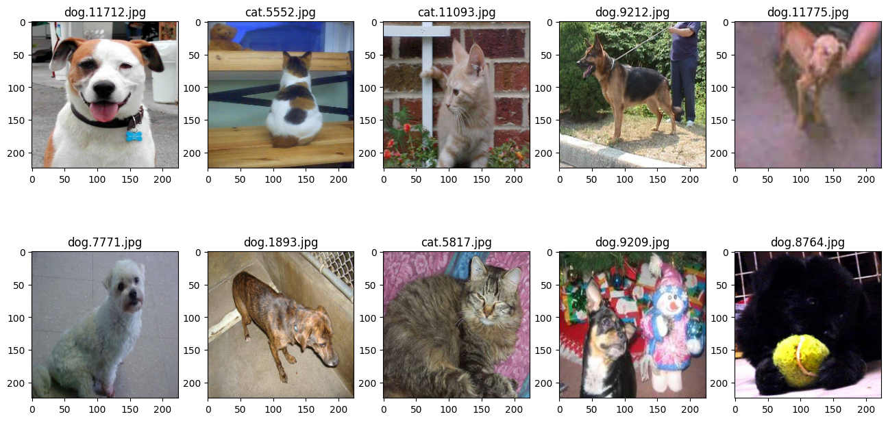
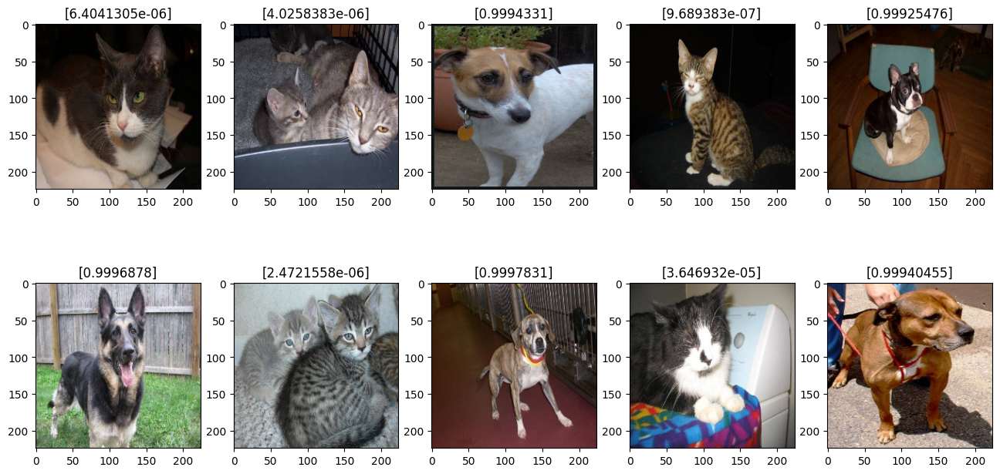
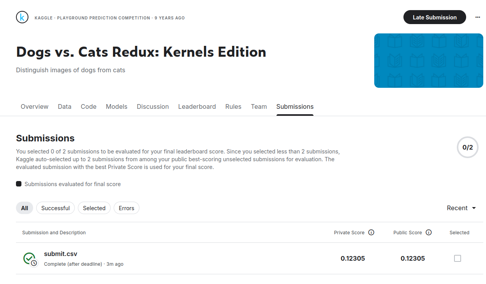

# Dogs vs Cats

https://www.kaggle.com/c/dogs-vs-cats-redux-kernels-edition


```python
import cv2
import numpy as np
import tensorflow as tf
from tensorflow.keras.applications import vgg16
from sklearn.model_selection import train_test_split
import os
from random import shuffle
from glob import glob
%matplotlib inline
from matplotlib import pyplot as plt
from tensorflow.keras import layers
from tensorflow import keras
from tensorflow.keras.callbacks import EarlyStopping, ModelCheckpoint, ReduceLROnPlateau
import re


print(tf.__version__)
print(tf.executing_eagerly())
```

    2026-05-15 21:49:42.149935: I tensorflow/core/util/port.cc:153] oneDNN custom operations are on. You may see slightly different numerical results due to floating-point round-off errors from different computation orders. To turn them off, set the environment variable `TF_ENABLE_ONEDNN_OPTS=0`.
    2026-05-15 21:49:42.503309: I tensorflow/core/platform/cpu_feature_guard.cc:210] This TensorFlow binary is optimized to use available CPU instructions in performance-critical operations.
    To enable the following instructions: AVX2 AVX_VNNI FMA, in other operations, rebuild TensorFlow with the appropriate compiler flags.
    2026-05-15 21:49:43.706073: I tensorflow/core/util/port.cc:153] oneDNN custom operations are on. You may see slightly different numerical results due to floating-point round-off errors from different computation orders. To turn them off, set the environment variable `TF_ENABLE_ONEDNN_OPTS=0`.


    2.20.0
    True


## Функции загрузки данных


```python
IMG_SIZE = (224, 224)  # размер входного изображения сети

train_files = glob('/home/slava/Documents/ML/Netology_NN/dogs-vs-cats-redux-kernels-edition/train/*.jpg')
test_files = glob('//home/slava/Documents/ML/Netology_NN/dogs-vs-cats-redux-kernels-edition/test/*.jpg')

# загружаем входное изображение и предобрабатываем
def load_image(path, target_size=IMG_SIZE):
    img = cv2.imread(path)[...,::-1]
    img = cv2.resize(img, target_size)
    return vgg16.preprocess_input(img)  # предобработка для VGG16

# функция-генератор загрузки обучающих данных с диска
def fit_generator(files, batch_size):
    batch_size = min(batch_size, len(files))
    while True:
        shuffle(files)
        for k in range(len(files) // batch_size):
            i = k * batch_size
            j = i + batch_size
            if j > len(files):
                j = - j % len(files)
            x = np.array([load_image(path) for path in files[i:j]])
            y = np.array([1. if os.path.basename(path).startswith('dog') else 0.
                          for path in files[i:j]])
            yield (x, y)

# функция-генератор загрузки тестовых изображений с диска
def predict_generator(files):
    while True:
        for path in files:
            yield (np.array([load_image(path)]),)
```

## Визуализируем примеры для обучения


```python
fig = plt.figure(figsize=(16, 8))
for i, path in enumerate(train_files[:10], 1):
    subplot = fig.add_subplot(2, 5, i)
    subplot.set_title('%s' % path.split('/')[-1])
    img = cv2.imread(path)[...,::-1]
    img = cv2.resize(img, IMG_SIZE)
    plt.imshow(img)
```


    

    


## Загружаем предобученную модель


```python
# base_model - объект класса keras.models.Model (Functional Model)
base_model = vgg16.VGG16(weights='imagenet',
                         include_top=False,
                         input_shape=(IMG_SIZE[0], IMG_SIZE[1], 3))
```

    WARNING: All log messages before absl::InitializeLog() is called are written to STDERR
    I0000 00:00:1778695494.744831    4493 gpu_device.cc:2020] Created device /job:localhost/replica:0/task:0/device:GPU:0 with 5814 MB memory:  -> device: 0, name: NVIDIA GeForce RTX 4060, pci bus id: 0000:01:00.0, compute capability: 8.9


```python
base_model.summary()
```


<pre style="white-space:pre;overflow-x:auto;line-height:normal;font-family:Menlo,'DejaVu Sans Mono',consolas,'Courier New',monospace"><span style="font-weight: bold">Model: "vgg16"</span>
</pre>


<pre style="white-space:pre;overflow-x:auto;line-height:normal;font-family:Menlo,'DejaVu Sans Mono',consolas,'Courier New',monospace">┏━━━━━━━━━━━━━━━━━━━━━━━━━━━━━━━━━┳━━━━━━━━━━━━━━━━━━━━━━━━┳━━━━━━━━━━━━━━━┓
┃<span style="font-weight: bold"> Layer (type)                    </span>┃<span style="font-weight: bold"> Output Shape           </span>┃<span style="font-weight: bold">       Param # </span>┃
┡━━━━━━━━━━━━━━━━━━━━━━━━━━━━━━━━━╇━━━━━━━━━━━━━━━━━━━━━━━━╇━━━━━━━━━━━━━━━┩
│ input_layer (<span style="color: #0087ff; text-decoration-color: #0087ff">InputLayer</span>)        │ (<span style="color: #00d7ff; text-decoration-color: #00d7ff">None</span>, <span style="color: #00af00; text-decoration-color: #00af00">224</span>, <span style="color: #00af00; text-decoration-color: #00af00">224</span>, <span style="color: #00af00; text-decoration-color: #00af00">3</span>)    │             <span style="color: #00af00; text-decoration-color: #00af00">0</span> │
├─────────────────────────────────┼────────────────────────┼───────────────┤
│ block1_conv1 (<span style="color: #0087ff; text-decoration-color: #0087ff">Conv2D</span>)           │ (<span style="color: #00d7ff; text-decoration-color: #00d7ff">None</span>, <span style="color: #00af00; text-decoration-color: #00af00">224</span>, <span style="color: #00af00; text-decoration-color: #00af00">224</span>, <span style="color: #00af00; text-decoration-color: #00af00">64</span>)   │         <span style="color: #00af00; text-decoration-color: #00af00">1,792</span> │
├─────────────────────────────────┼────────────────────────┼───────────────┤
│ block1_conv2 (<span style="color: #0087ff; text-decoration-color: #0087ff">Conv2D</span>)           │ (<span style="color: #00d7ff; text-decoration-color: #00d7ff">None</span>, <span style="color: #00af00; text-decoration-color: #00af00">224</span>, <span style="color: #00af00; text-decoration-color: #00af00">224</span>, <span style="color: #00af00; text-decoration-color: #00af00">64</span>)   │        <span style="color: #00af00; text-decoration-color: #00af00">36,928</span> │
├─────────────────────────────────┼────────────────────────┼───────────────┤
│ block1_pool (<span style="color: #0087ff; text-decoration-color: #0087ff">MaxPooling2D</span>)      │ (<span style="color: #00d7ff; text-decoration-color: #00d7ff">None</span>, <span style="color: #00af00; text-decoration-color: #00af00">112</span>, <span style="color: #00af00; text-decoration-color: #00af00">112</span>, <span style="color: #00af00; text-decoration-color: #00af00">64</span>)   │             <span style="color: #00af00; text-decoration-color: #00af00">0</span> │
├─────────────────────────────────┼────────────────────────┼───────────────┤
│ block2_conv1 (<span style="color: #0087ff; text-decoration-color: #0087ff">Conv2D</span>)           │ (<span style="color: #00d7ff; text-decoration-color: #00d7ff">None</span>, <span style="color: #00af00; text-decoration-color: #00af00">112</span>, <span style="color: #00af00; text-decoration-color: #00af00">112</span>, <span style="color: #00af00; text-decoration-color: #00af00">128</span>)  │        <span style="color: #00af00; text-decoration-color: #00af00">73,856</span> │
├─────────────────────────────────┼────────────────────────┼───────────────┤
│ block2_conv2 (<span style="color: #0087ff; text-decoration-color: #0087ff">Conv2D</span>)           │ (<span style="color: #00d7ff; text-decoration-color: #00d7ff">None</span>, <span style="color: #00af00; text-decoration-color: #00af00">112</span>, <span style="color: #00af00; text-decoration-color: #00af00">112</span>, <span style="color: #00af00; text-decoration-color: #00af00">128</span>)  │       <span style="color: #00af00; text-decoration-color: #00af00">147,584</span> │
├─────────────────────────────────┼────────────────────────┼───────────────┤
│ block2_pool (<span style="color: #0087ff; text-decoration-color: #0087ff">MaxPooling2D</span>)      │ (<span style="color: #00d7ff; text-decoration-color: #00d7ff">None</span>, <span style="color: #00af00; text-decoration-color: #00af00">56</span>, <span style="color: #00af00; text-decoration-color: #00af00">56</span>, <span style="color: #00af00; text-decoration-color: #00af00">128</span>)    │             <span style="color: #00af00; text-decoration-color: #00af00">0</span> │
├─────────────────────────────────┼────────────────────────┼───────────────┤
│ block3_conv1 (<span style="color: #0087ff; text-decoration-color: #0087ff">Conv2D</span>)           │ (<span style="color: #00d7ff; text-decoration-color: #00d7ff">None</span>, <span style="color: #00af00; text-decoration-color: #00af00">56</span>, <span style="color: #00af00; text-decoration-color: #00af00">56</span>, <span style="color: #00af00; text-decoration-color: #00af00">256</span>)    │       <span style="color: #00af00; text-decoration-color: #00af00">295,168</span> │
├─────────────────────────────────┼────────────────────────┼───────────────┤
│ block3_conv2 (<span style="color: #0087ff; text-decoration-color: #0087ff">Conv2D</span>)           │ (<span style="color: #00d7ff; text-decoration-color: #00d7ff">None</span>, <span style="color: #00af00; text-decoration-color: #00af00">56</span>, <span style="color: #00af00; text-decoration-color: #00af00">56</span>, <span style="color: #00af00; text-decoration-color: #00af00">256</span>)    │       <span style="color: #00af00; text-decoration-color: #00af00">590,080</span> │
├─────────────────────────────────┼────────────────────────┼───────────────┤
│ block3_conv3 (<span style="color: #0087ff; text-decoration-color: #0087ff">Conv2D</span>)           │ (<span style="color: #00d7ff; text-decoration-color: #00d7ff">None</span>, <span style="color: #00af00; text-decoration-color: #00af00">56</span>, <span style="color: #00af00; text-decoration-color: #00af00">56</span>, <span style="color: #00af00; text-decoration-color: #00af00">256</span>)    │       <span style="color: #00af00; text-decoration-color: #00af00">590,080</span> │
├─────────────────────────────────┼────────────────────────┼───────────────┤
│ block3_pool (<span style="color: #0087ff; text-decoration-color: #0087ff">MaxPooling2D</span>)      │ (<span style="color: #00d7ff; text-decoration-color: #00d7ff">None</span>, <span style="color: #00af00; text-decoration-color: #00af00">28</span>, <span style="color: #00af00; text-decoration-color: #00af00">28</span>, <span style="color: #00af00; text-decoration-color: #00af00">256</span>)    │             <span style="color: #00af00; text-decoration-color: #00af00">0</span> │
├─────────────────────────────────┼────────────────────────┼───────────────┤
│ block4_conv1 (<span style="color: #0087ff; text-decoration-color: #0087ff">Conv2D</span>)           │ (<span style="color: #00d7ff; text-decoration-color: #00d7ff">None</span>, <span style="color: #00af00; text-decoration-color: #00af00">28</span>, <span style="color: #00af00; text-decoration-color: #00af00">28</span>, <span style="color: #00af00; text-decoration-color: #00af00">512</span>)    │     <span style="color: #00af00; text-decoration-color: #00af00">1,180,160</span> │
├─────────────────────────────────┼────────────────────────┼───────────────┤
│ block4_conv2 (<span style="color: #0087ff; text-decoration-color: #0087ff">Conv2D</span>)           │ (<span style="color: #00d7ff; text-decoration-color: #00d7ff">None</span>, <span style="color: #00af00; text-decoration-color: #00af00">28</span>, <span style="color: #00af00; text-decoration-color: #00af00">28</span>, <span style="color: #00af00; text-decoration-color: #00af00">512</span>)    │     <span style="color: #00af00; text-decoration-color: #00af00">2,359,808</span> │
├─────────────────────────────────┼────────────────────────┼───────────────┤
│ block4_conv3 (<span style="color: #0087ff; text-decoration-color: #0087ff">Conv2D</span>)           │ (<span style="color: #00d7ff; text-decoration-color: #00d7ff">None</span>, <span style="color: #00af00; text-decoration-color: #00af00">28</span>, <span style="color: #00af00; text-decoration-color: #00af00">28</span>, <span style="color: #00af00; text-decoration-color: #00af00">512</span>)    │     <span style="color: #00af00; text-decoration-color: #00af00">2,359,808</span> │
├─────────────────────────────────┼────────────────────────┼───────────────┤
│ block4_pool (<span style="color: #0087ff; text-decoration-color: #0087ff">MaxPooling2D</span>)      │ (<span style="color: #00d7ff; text-decoration-color: #00d7ff">None</span>, <span style="color: #00af00; text-decoration-color: #00af00">14</span>, <span style="color: #00af00; text-decoration-color: #00af00">14</span>, <span style="color: #00af00; text-decoration-color: #00af00">512</span>)    │             <span style="color: #00af00; text-decoration-color: #00af00">0</span> │
├─────────────────────────────────┼────────────────────────┼───────────────┤
│ block5_conv1 (<span style="color: #0087ff; text-decoration-color: #0087ff">Conv2D</span>)           │ (<span style="color: #00d7ff; text-decoration-color: #00d7ff">None</span>, <span style="color: #00af00; text-decoration-color: #00af00">14</span>, <span style="color: #00af00; text-decoration-color: #00af00">14</span>, <span style="color: #00af00; text-decoration-color: #00af00">512</span>)    │     <span style="color: #00af00; text-decoration-color: #00af00">2,359,808</span> │
├─────────────────────────────────┼────────────────────────┼───────────────┤
│ block5_conv2 (<span style="color: #0087ff; text-decoration-color: #0087ff">Conv2D</span>)           │ (<span style="color: #00d7ff; text-decoration-color: #00d7ff">None</span>, <span style="color: #00af00; text-decoration-color: #00af00">14</span>, <span style="color: #00af00; text-decoration-color: #00af00">14</span>, <span style="color: #00af00; text-decoration-color: #00af00">512</span>)    │     <span style="color: #00af00; text-decoration-color: #00af00">2,359,808</span> │
├─────────────────────────────────┼────────────────────────┼───────────────┤
│ block5_conv3 (<span style="color: #0087ff; text-decoration-color: #0087ff">Conv2D</span>)           │ (<span style="color: #00d7ff; text-decoration-color: #00d7ff">None</span>, <span style="color: #00af00; text-decoration-color: #00af00">14</span>, <span style="color: #00af00; text-decoration-color: #00af00">14</span>, <span style="color: #00af00; text-decoration-color: #00af00">512</span>)    │     <span style="color: #00af00; text-decoration-color: #00af00">2,359,808</span> │
├─────────────────────────────────┼────────────────────────┼───────────────┤
│ block5_pool (<span style="color: #0087ff; text-decoration-color: #0087ff">MaxPooling2D</span>)      │ (<span style="color: #00d7ff; text-decoration-color: #00d7ff">None</span>, <span style="color: #00af00; text-decoration-color: #00af00">7</span>, <span style="color: #00af00; text-decoration-color: #00af00">7</span>, <span style="color: #00af00; text-decoration-color: #00af00">512</span>)      │             <span style="color: #00af00; text-decoration-color: #00af00">0</span> │
└─────────────────────────────────┴────────────────────────┴───────────────┘
</pre>


<pre style="white-space:pre;overflow-x:auto;line-height:normal;font-family:Menlo,'DejaVu Sans Mono',consolas,'Courier New',monospace"><span style="font-weight: bold"> Total params: </span><span style="color: #00af00; text-decoration-color: #00af00">14,714,688</span> (56.13 MB)
</pre>


<pre style="white-space:pre;overflow-x:auto;line-height:normal;font-family:Menlo,'DejaVu Sans Mono',consolas,'Courier New',monospace"><span style="font-weight: bold"> Trainable params: </span><span style="color: #00af00; text-decoration-color: #00af00">14,714,688</span> (56.13 MB)
</pre>


<pre style="white-space:pre;overflow-x:auto;line-height:normal;font-family:Menlo,'DejaVu Sans Mono',consolas,'Courier New',monospace"><span style="font-weight: bold"> Non-trainable params: </span><span style="color: #00af00; text-decoration-color: #00af00">0</span> (0.00 B)
</pre>


## Добавляем полносвязный слой


```python
# фиксируем все веса предобученной сети
for layer in base_model.layers:
    layer.trainable = False

# Получаем выход из предпоследнего слоя base_model
x = base_model.layers[-5].output

# Добавляем свои слои
x = layers.Conv2D(64, (3, 3), padding='same', activation='relu')(x)
x = layers.BatchNormalization()(x)
x = layers.Conv2D(128, (3, 3), padding='same', activation='relu')(x)
x = layers.BatchNormalization()(x)
x = layers.MaxPooling2D((2, 2))(x)
x = layers.Dropout(0.3)(x)

x = layers.Conv2D(128, (3, 3), padding='same', activation='relu')(x)
x = layers.BatchNormalization()(x)
x = layers.Conv2D(256, (3, 3), padding='same', activation='relu')(x)
x = layers.BatchNormalization()(x)
x = layers.MaxPooling2D((2, 2))(x)
x = layers.Dropout(0.4)(x)

x = layers.Conv2D(256, (3, 3), padding='same', activation='relu')(x)
x = layers.BatchNormalization()(x)
x = layers.Conv2D(512, (3, 3), padding='same', activation='relu')(x)
x = layers.BatchNormalization()(x)
x = layers.MaxPooling2D((2, 2))(x)
x = layers.Dropout(0.5)(x)

x = layers.Flatten()(x)
x = layers.Dense(1024, activation='relu')(x)
x = layers.BatchNormalization()(x)
x = layers.Dropout(0.6)(x)
output = layers.Dense(1, activation='sigmoid')(x)

# Создаем модель
model = keras.Model(inputs=base_model.input, outputs=output, name='dogs_vs_cats')
```

## Выводим архитектуру модели


```python
model.summary()
```


<pre style="white-space:pre;overflow-x:auto;line-height:normal;font-family:Menlo,'DejaVu Sans Mono',consolas,'Courier New',monospace"><span style="font-weight: bold">Model: "dogs_vs_cats"</span>
</pre>


<pre style="white-space:pre;overflow-x:auto;line-height:normal;font-family:Menlo,'DejaVu Sans Mono',consolas,'Courier New',monospace">┏━━━━━━━━━━━━━━━━━━━━━━━━━━━━━━━━━┳━━━━━━━━━━━━━━━━━━━━━━━━┳━━━━━━━━━━━━━━━┓
┃<span style="font-weight: bold"> Layer (type)                    </span>┃<span style="font-weight: bold"> Output Shape           </span>┃<span style="font-weight: bold">       Param # </span>┃
┡━━━━━━━━━━━━━━━━━━━━━━━━━━━━━━━━━╇━━━━━━━━━━━━━━━━━━━━━━━━╇━━━━━━━━━━━━━━━┩
│ input_layer (<span style="color: #0087ff; text-decoration-color: #0087ff">InputLayer</span>)        │ (<span style="color: #00d7ff; text-decoration-color: #00d7ff">None</span>, <span style="color: #00af00; text-decoration-color: #00af00">224</span>, <span style="color: #00af00; text-decoration-color: #00af00">224</span>, <span style="color: #00af00; text-decoration-color: #00af00">3</span>)    │             <span style="color: #00af00; text-decoration-color: #00af00">0</span> │
├─────────────────────────────────┼────────────────────────┼───────────────┤
│ block1_conv1 (<span style="color: #0087ff; text-decoration-color: #0087ff">Conv2D</span>)           │ (<span style="color: #00d7ff; text-decoration-color: #00d7ff">None</span>, <span style="color: #00af00; text-decoration-color: #00af00">224</span>, <span style="color: #00af00; text-decoration-color: #00af00">224</span>, <span style="color: #00af00; text-decoration-color: #00af00">64</span>)   │         <span style="color: #00af00; text-decoration-color: #00af00">1,792</span> │
├─────────────────────────────────┼────────────────────────┼───────────────┤
│ block1_conv2 (<span style="color: #0087ff; text-decoration-color: #0087ff">Conv2D</span>)           │ (<span style="color: #00d7ff; text-decoration-color: #00d7ff">None</span>, <span style="color: #00af00; text-decoration-color: #00af00">224</span>, <span style="color: #00af00; text-decoration-color: #00af00">224</span>, <span style="color: #00af00; text-decoration-color: #00af00">64</span>)   │        <span style="color: #00af00; text-decoration-color: #00af00">36,928</span> │
├─────────────────────────────────┼────────────────────────┼───────────────┤
│ block1_pool (<span style="color: #0087ff; text-decoration-color: #0087ff">MaxPooling2D</span>)      │ (<span style="color: #00d7ff; text-decoration-color: #00d7ff">None</span>, <span style="color: #00af00; text-decoration-color: #00af00">112</span>, <span style="color: #00af00; text-decoration-color: #00af00">112</span>, <span style="color: #00af00; text-decoration-color: #00af00">64</span>)   │             <span style="color: #00af00; text-decoration-color: #00af00">0</span> │
├─────────────────────────────────┼────────────────────────┼───────────────┤
│ block2_conv1 (<span style="color: #0087ff; text-decoration-color: #0087ff">Conv2D</span>)           │ (<span style="color: #00d7ff; text-decoration-color: #00d7ff">None</span>, <span style="color: #00af00; text-decoration-color: #00af00">112</span>, <span style="color: #00af00; text-decoration-color: #00af00">112</span>, <span style="color: #00af00; text-decoration-color: #00af00">128</span>)  │        <span style="color: #00af00; text-decoration-color: #00af00">73,856</span> │
├─────────────────────────────────┼────────────────────────┼───────────────┤
│ block2_conv2 (<span style="color: #0087ff; text-decoration-color: #0087ff">Conv2D</span>)           │ (<span style="color: #00d7ff; text-decoration-color: #00d7ff">None</span>, <span style="color: #00af00; text-decoration-color: #00af00">112</span>, <span style="color: #00af00; text-decoration-color: #00af00">112</span>, <span style="color: #00af00; text-decoration-color: #00af00">128</span>)  │       <span style="color: #00af00; text-decoration-color: #00af00">147,584</span> │
├─────────────────────────────────┼────────────────────────┼───────────────┤
│ block2_pool (<span style="color: #0087ff; text-decoration-color: #0087ff">MaxPooling2D</span>)      │ (<span style="color: #00d7ff; text-decoration-color: #00d7ff">None</span>, <span style="color: #00af00; text-decoration-color: #00af00">56</span>, <span style="color: #00af00; text-decoration-color: #00af00">56</span>, <span style="color: #00af00; text-decoration-color: #00af00">128</span>)    │             <span style="color: #00af00; text-decoration-color: #00af00">0</span> │
├─────────────────────────────────┼────────────────────────┼───────────────┤
│ block3_conv1 (<span style="color: #0087ff; text-decoration-color: #0087ff">Conv2D</span>)           │ (<span style="color: #00d7ff; text-decoration-color: #00d7ff">None</span>, <span style="color: #00af00; text-decoration-color: #00af00">56</span>, <span style="color: #00af00; text-decoration-color: #00af00">56</span>, <span style="color: #00af00; text-decoration-color: #00af00">256</span>)    │       <span style="color: #00af00; text-decoration-color: #00af00">295,168</span> │
├─────────────────────────────────┼────────────────────────┼───────────────┤
│ block3_conv2 (<span style="color: #0087ff; text-decoration-color: #0087ff">Conv2D</span>)           │ (<span style="color: #00d7ff; text-decoration-color: #00d7ff">None</span>, <span style="color: #00af00; text-decoration-color: #00af00">56</span>, <span style="color: #00af00; text-decoration-color: #00af00">56</span>, <span style="color: #00af00; text-decoration-color: #00af00">256</span>)    │       <span style="color: #00af00; text-decoration-color: #00af00">590,080</span> │
├─────────────────────────────────┼────────────────────────┼───────────────┤
│ block3_conv3 (<span style="color: #0087ff; text-decoration-color: #0087ff">Conv2D</span>)           │ (<span style="color: #00d7ff; text-decoration-color: #00d7ff">None</span>, <span style="color: #00af00; text-decoration-color: #00af00">56</span>, <span style="color: #00af00; text-decoration-color: #00af00">56</span>, <span style="color: #00af00; text-decoration-color: #00af00">256</span>)    │       <span style="color: #00af00; text-decoration-color: #00af00">590,080</span> │
├─────────────────────────────────┼────────────────────────┼───────────────┤
│ block3_pool (<span style="color: #0087ff; text-decoration-color: #0087ff">MaxPooling2D</span>)      │ (<span style="color: #00d7ff; text-decoration-color: #00d7ff">None</span>, <span style="color: #00af00; text-decoration-color: #00af00">28</span>, <span style="color: #00af00; text-decoration-color: #00af00">28</span>, <span style="color: #00af00; text-decoration-color: #00af00">256</span>)    │             <span style="color: #00af00; text-decoration-color: #00af00">0</span> │
├─────────────────────────────────┼────────────────────────┼───────────────┤
│ block4_conv1 (<span style="color: #0087ff; text-decoration-color: #0087ff">Conv2D</span>)           │ (<span style="color: #00d7ff; text-decoration-color: #00d7ff">None</span>, <span style="color: #00af00; text-decoration-color: #00af00">28</span>, <span style="color: #00af00; text-decoration-color: #00af00">28</span>, <span style="color: #00af00; text-decoration-color: #00af00">512</span>)    │     <span style="color: #00af00; text-decoration-color: #00af00">1,180,160</span> │
├─────────────────────────────────┼────────────────────────┼───────────────┤
│ block4_conv2 (<span style="color: #0087ff; text-decoration-color: #0087ff">Conv2D</span>)           │ (<span style="color: #00d7ff; text-decoration-color: #00d7ff">None</span>, <span style="color: #00af00; text-decoration-color: #00af00">28</span>, <span style="color: #00af00; text-decoration-color: #00af00">28</span>, <span style="color: #00af00; text-decoration-color: #00af00">512</span>)    │     <span style="color: #00af00; text-decoration-color: #00af00">2,359,808</span> │
├─────────────────────────────────┼────────────────────────┼───────────────┤
│ block4_conv3 (<span style="color: #0087ff; text-decoration-color: #0087ff">Conv2D</span>)           │ (<span style="color: #00d7ff; text-decoration-color: #00d7ff">None</span>, <span style="color: #00af00; text-decoration-color: #00af00">28</span>, <span style="color: #00af00; text-decoration-color: #00af00">28</span>, <span style="color: #00af00; text-decoration-color: #00af00">512</span>)    │     <span style="color: #00af00; text-decoration-color: #00af00">2,359,808</span> │
├─────────────────────────────────┼────────────────────────┼───────────────┤
│ block4_pool (<span style="color: #0087ff; text-decoration-color: #0087ff">MaxPooling2D</span>)      │ (<span style="color: #00d7ff; text-decoration-color: #00d7ff">None</span>, <span style="color: #00af00; text-decoration-color: #00af00">14</span>, <span style="color: #00af00; text-decoration-color: #00af00">14</span>, <span style="color: #00af00; text-decoration-color: #00af00">512</span>)    │             <span style="color: #00af00; text-decoration-color: #00af00">0</span> │
├─────────────────────────────────┼────────────────────────┼───────────────┤
│ conv2d_6 (<span style="color: #0087ff; text-decoration-color: #0087ff">Conv2D</span>)               │ (<span style="color: #00d7ff; text-decoration-color: #00d7ff">None</span>, <span style="color: #00af00; text-decoration-color: #00af00">14</span>, <span style="color: #00af00; text-decoration-color: #00af00">14</span>, <span style="color: #00af00; text-decoration-color: #00af00">64</span>)     │       <span style="color: #00af00; text-decoration-color: #00af00">294,976</span> │
├─────────────────────────────────┼────────────────────────┼───────────────┤
│ batch_normalization_7           │ (<span style="color: #00d7ff; text-decoration-color: #00d7ff">None</span>, <span style="color: #00af00; text-decoration-color: #00af00">14</span>, <span style="color: #00af00; text-decoration-color: #00af00">14</span>, <span style="color: #00af00; text-decoration-color: #00af00">64</span>)     │           <span style="color: #00af00; text-decoration-color: #00af00">256</span> │
│ (<span style="color: #0087ff; text-decoration-color: #0087ff">BatchNormalization</span>)            │                        │               │
├─────────────────────────────────┼────────────────────────┼───────────────┤
│ conv2d_7 (<span style="color: #0087ff; text-decoration-color: #0087ff">Conv2D</span>)               │ (<span style="color: #00d7ff; text-decoration-color: #00d7ff">None</span>, <span style="color: #00af00; text-decoration-color: #00af00">14</span>, <span style="color: #00af00; text-decoration-color: #00af00">14</span>, <span style="color: #00af00; text-decoration-color: #00af00">128</span>)    │        <span style="color: #00af00; text-decoration-color: #00af00">73,856</span> │
├─────────────────────────────────┼────────────────────────┼───────────────┤
│ batch_normalization_8           │ (<span style="color: #00d7ff; text-decoration-color: #00d7ff">None</span>, <span style="color: #00af00; text-decoration-color: #00af00">14</span>, <span style="color: #00af00; text-decoration-color: #00af00">14</span>, <span style="color: #00af00; text-decoration-color: #00af00">128</span>)    │           <span style="color: #00af00; text-decoration-color: #00af00">512</span> │
│ (<span style="color: #0087ff; text-decoration-color: #0087ff">BatchNormalization</span>)            │                        │               │
├─────────────────────────────────┼────────────────────────┼───────────────┤
│ max_pooling2d_3 (<span style="color: #0087ff; text-decoration-color: #0087ff">MaxPooling2D</span>)  │ (<span style="color: #00d7ff; text-decoration-color: #00d7ff">None</span>, <span style="color: #00af00; text-decoration-color: #00af00">7</span>, <span style="color: #00af00; text-decoration-color: #00af00">7</span>, <span style="color: #00af00; text-decoration-color: #00af00">128</span>)      │             <span style="color: #00af00; text-decoration-color: #00af00">0</span> │
├─────────────────────────────────┼────────────────────────┼───────────────┤
│ dropout_4 (<span style="color: #0087ff; text-decoration-color: #0087ff">Dropout</span>)             │ (<span style="color: #00d7ff; text-decoration-color: #00d7ff">None</span>, <span style="color: #00af00; text-decoration-color: #00af00">7</span>, <span style="color: #00af00; text-decoration-color: #00af00">7</span>, <span style="color: #00af00; text-decoration-color: #00af00">128</span>)      │             <span style="color: #00af00; text-decoration-color: #00af00">0</span> │
├─────────────────────────────────┼────────────────────────┼───────────────┤
│ conv2d_8 (<span style="color: #0087ff; text-decoration-color: #0087ff">Conv2D</span>)               │ (<span style="color: #00d7ff; text-decoration-color: #00d7ff">None</span>, <span style="color: #00af00; text-decoration-color: #00af00">7</span>, <span style="color: #00af00; text-decoration-color: #00af00">7</span>, <span style="color: #00af00; text-decoration-color: #00af00">128</span>)      │       <span style="color: #00af00; text-decoration-color: #00af00">147,584</span> │
├─────────────────────────────────┼────────────────────────┼───────────────┤
│ batch_normalization_9           │ (<span style="color: #00d7ff; text-decoration-color: #00d7ff">None</span>, <span style="color: #00af00; text-decoration-color: #00af00">7</span>, <span style="color: #00af00; text-decoration-color: #00af00">7</span>, <span style="color: #00af00; text-decoration-color: #00af00">128</span>)      │           <span style="color: #00af00; text-decoration-color: #00af00">512</span> │
│ (<span style="color: #0087ff; text-decoration-color: #0087ff">BatchNormalization</span>)            │                        │               │
├─────────────────────────────────┼────────────────────────┼───────────────┤
│ conv2d_9 (<span style="color: #0087ff; text-decoration-color: #0087ff">Conv2D</span>)               │ (<span style="color: #00d7ff; text-decoration-color: #00d7ff">None</span>, <span style="color: #00af00; text-decoration-color: #00af00">7</span>, <span style="color: #00af00; text-decoration-color: #00af00">7</span>, <span style="color: #00af00; text-decoration-color: #00af00">256</span>)      │       <span style="color: #00af00; text-decoration-color: #00af00">295,168</span> │
├─────────────────────────────────┼────────────────────────┼───────────────┤
│ batch_normalization_10          │ (<span style="color: #00d7ff; text-decoration-color: #00d7ff">None</span>, <span style="color: #00af00; text-decoration-color: #00af00">7</span>, <span style="color: #00af00; text-decoration-color: #00af00">7</span>, <span style="color: #00af00; text-decoration-color: #00af00">256</span>)      │         <span style="color: #00af00; text-decoration-color: #00af00">1,024</span> │
│ (<span style="color: #0087ff; text-decoration-color: #0087ff">BatchNormalization</span>)            │                        │               │
├─────────────────────────────────┼────────────────────────┼───────────────┤
│ max_pooling2d_4 (<span style="color: #0087ff; text-decoration-color: #0087ff">MaxPooling2D</span>)  │ (<span style="color: #00d7ff; text-decoration-color: #00d7ff">None</span>, <span style="color: #00af00; text-decoration-color: #00af00">3</span>, <span style="color: #00af00; text-decoration-color: #00af00">3</span>, <span style="color: #00af00; text-decoration-color: #00af00">256</span>)      │             <span style="color: #00af00; text-decoration-color: #00af00">0</span> │
├─────────────────────────────────┼────────────────────────┼───────────────┤
│ dropout_5 (<span style="color: #0087ff; text-decoration-color: #0087ff">Dropout</span>)             │ (<span style="color: #00d7ff; text-decoration-color: #00d7ff">None</span>, <span style="color: #00af00; text-decoration-color: #00af00">3</span>, <span style="color: #00af00; text-decoration-color: #00af00">3</span>, <span style="color: #00af00; text-decoration-color: #00af00">256</span>)      │             <span style="color: #00af00; text-decoration-color: #00af00">0</span> │
├─────────────────────────────────┼────────────────────────┼───────────────┤
│ conv2d_10 (<span style="color: #0087ff; text-decoration-color: #0087ff">Conv2D</span>)              │ (<span style="color: #00d7ff; text-decoration-color: #00d7ff">None</span>, <span style="color: #00af00; text-decoration-color: #00af00">3</span>, <span style="color: #00af00; text-decoration-color: #00af00">3</span>, <span style="color: #00af00; text-decoration-color: #00af00">256</span>)      │       <span style="color: #00af00; text-decoration-color: #00af00">590,080</span> │
├─────────────────────────────────┼────────────────────────┼───────────────┤
│ batch_normalization_11          │ (<span style="color: #00d7ff; text-decoration-color: #00d7ff">None</span>, <span style="color: #00af00; text-decoration-color: #00af00">3</span>, <span style="color: #00af00; text-decoration-color: #00af00">3</span>, <span style="color: #00af00; text-decoration-color: #00af00">256</span>)      │         <span style="color: #00af00; text-decoration-color: #00af00">1,024</span> │
│ (<span style="color: #0087ff; text-decoration-color: #0087ff">BatchNormalization</span>)            │                        │               │
├─────────────────────────────────┼────────────────────────┼───────────────┤
│ conv2d_11 (<span style="color: #0087ff; text-decoration-color: #0087ff">Conv2D</span>)              │ (<span style="color: #00d7ff; text-decoration-color: #00d7ff">None</span>, <span style="color: #00af00; text-decoration-color: #00af00">3</span>, <span style="color: #00af00; text-decoration-color: #00af00">3</span>, <span style="color: #00af00; text-decoration-color: #00af00">512</span>)      │     <span style="color: #00af00; text-decoration-color: #00af00">1,180,160</span> │
├─────────────────────────────────┼────────────────────────┼───────────────┤
│ batch_normalization_12          │ (<span style="color: #00d7ff; text-decoration-color: #00d7ff">None</span>, <span style="color: #00af00; text-decoration-color: #00af00">3</span>, <span style="color: #00af00; text-decoration-color: #00af00">3</span>, <span style="color: #00af00; text-decoration-color: #00af00">512</span>)      │         <span style="color: #00af00; text-decoration-color: #00af00">2,048</span> │
│ (<span style="color: #0087ff; text-decoration-color: #0087ff">BatchNormalization</span>)            │                        │               │
├─────────────────────────────────┼────────────────────────┼───────────────┤
│ max_pooling2d_5 (<span style="color: #0087ff; text-decoration-color: #0087ff">MaxPooling2D</span>)  │ (<span style="color: #00d7ff; text-decoration-color: #00d7ff">None</span>, <span style="color: #00af00; text-decoration-color: #00af00">1</span>, <span style="color: #00af00; text-decoration-color: #00af00">1</span>, <span style="color: #00af00; text-decoration-color: #00af00">512</span>)      │             <span style="color: #00af00; text-decoration-color: #00af00">0</span> │
├─────────────────────────────────┼────────────────────────┼───────────────┤
│ dropout_6 (<span style="color: #0087ff; text-decoration-color: #0087ff">Dropout</span>)             │ (<span style="color: #00d7ff; text-decoration-color: #00d7ff">None</span>, <span style="color: #00af00; text-decoration-color: #00af00">1</span>, <span style="color: #00af00; text-decoration-color: #00af00">1</span>, <span style="color: #00af00; text-decoration-color: #00af00">512</span>)      │             <span style="color: #00af00; text-decoration-color: #00af00">0</span> │
├─────────────────────────────────┼────────────────────────┼───────────────┤
│ flatten_1 (<span style="color: #0087ff; text-decoration-color: #0087ff">Flatten</span>)             │ (<span style="color: #00d7ff; text-decoration-color: #00d7ff">None</span>, <span style="color: #00af00; text-decoration-color: #00af00">512</span>)            │             <span style="color: #00af00; text-decoration-color: #00af00">0</span> │
├─────────────────────────────────┼────────────────────────┼───────────────┤
│ dense_2 (<span style="color: #0087ff; text-decoration-color: #0087ff">Dense</span>)                 │ (<span style="color: #00d7ff; text-decoration-color: #00d7ff">None</span>, <span style="color: #00af00; text-decoration-color: #00af00">1024</span>)           │       <span style="color: #00af00; text-decoration-color: #00af00">525,312</span> │
├─────────────────────────────────┼────────────────────────┼───────────────┤
│ batch_normalization_13          │ (<span style="color: #00d7ff; text-decoration-color: #00d7ff">None</span>, <span style="color: #00af00; text-decoration-color: #00af00">1024</span>)           │         <span style="color: #00af00; text-decoration-color: #00af00">4,096</span> │
│ (<span style="color: #0087ff; text-decoration-color: #0087ff">BatchNormalization</span>)            │                        │               │
├─────────────────────────────────┼────────────────────────┼───────────────┤
│ dropout_7 (<span style="color: #0087ff; text-decoration-color: #0087ff">Dropout</span>)             │ (<span style="color: #00d7ff; text-decoration-color: #00d7ff">None</span>, <span style="color: #00af00; text-decoration-color: #00af00">1024</span>)           │             <span style="color: #00af00; text-decoration-color: #00af00">0</span> │
├─────────────────────────────────┼────────────────────────┼───────────────┤
│ dense_3 (<span style="color: #0087ff; text-decoration-color: #0087ff">Dense</span>)                 │ (<span style="color: #00d7ff; text-decoration-color: #00d7ff">None</span>, <span style="color: #00af00; text-decoration-color: #00af00">1</span>)              │         <span style="color: #00af00; text-decoration-color: #00af00">1,025</span> │
└─────────────────────────────────┴────────────────────────┴───────────────┘
</pre>


<pre style="white-space:pre;overflow-x:auto;line-height:normal;font-family:Menlo,'DejaVu Sans Mono',consolas,'Courier New',monospace"><span style="font-weight: bold"> Total params: </span><span style="color: #00af00; text-decoration-color: #00af00">10,752,897</span> (41.02 MB)
</pre>


<pre style="white-space:pre;overflow-x:auto;line-height:normal;font-family:Menlo,'DejaVu Sans Mono',consolas,'Courier New',monospace"><span style="font-weight: bold"> Trainable params: </span><span style="color: #00af00; text-decoration-color: #00af00">3,112,897</span> (11.87 MB)
</pre>


<pre style="white-space:pre;overflow-x:auto;line-height:normal;font-family:Menlo,'DejaVu Sans Mono',consolas,'Courier New',monospace"><span style="font-weight: bold"> Non-trainable params: </span><span style="color: #00af00; text-decoration-color: #00af00">7,640,000</span> (29.14 MB)
</pre>


## Компилируем модель и запускаем обучение


```python
model.compile(optimizer='adam', 
              loss='binary_crossentropy',  # функция потерь binary_crossentropy (log loss
              metrics=['accuracy'])
```


```python
train_cut_files, val_files = train_test_split(
    train_files,
    test_size=0.2,   
    random_state=42,
    stratify=None
)

BATCH_SIZE = 128

train_ds = fit_generator(train_cut_files, BATCH_SIZE)
val_ds = fit_generator(val_files, BATCH_SIZE)

callbacks = [
    EarlyStopping(
        monitor='val_accuracy',
        patience=5,
        restore_best_weights=True,
        verbose=1
    ),
    
    ModelCheckpoint(
        'best_model.h5',
        monitor='val_accuracy',
        save_best_only=True,
        verbose=1
    ),
    
    ReduceLROnPlateau(
        monitor='val_loss',
        factor=0.5,
        patience=5,
        min_lr=1e-7,
        verbose=1
    )
]

model.fit(
    train_ds,
    steps_per_epoch=len(train_cut_files) // BATCH_SIZE,
    epochs=100,
    validation_data=val_ds,
    validation_steps=len(val_files) // BATCH_SIZE,
    callbacks=callbacks
)
```

    Epoch 1/100


    2026-05-13 21:11:53.813547: I external/local_xla/xla/service/service.cc:163] XLA service 0x7976b0020b40 initialized for platform CUDA (this does not guarantee that XLA will be used). Devices:
    2026-05-13 21:11:53.813563: I external/local_xla/xla/service/service.cc:171]   StreamExecutor device (0): NVIDIA GeForce RTX 4060, Compute Capability 8.9
    2026-05-13 21:11:53.878782: I tensorflow/compiler/mlir/tensorflow/utils/dump_mlir_util.cc:269] disabling MLIR crash reproducer, set env var `MLIR_CRASH_REPRODUCER_DIRECTORY` to enable.
    2026-05-13 21:11:54.344781: I external/local_xla/xla/stream_executor/cuda/cuda_dnn.cc:473] Loaded cuDNN version 91002
    2026-05-13 21:11:55.097204: I external/local_xla/xla/stream_executor/cuda/subprocess_compilation.cc:346] ptxas warning : Registers are spilled to local memory in function 'gemm_fusion_dot_4141', 892 bytes spill stores, 892 bytes spill loads
    
    2026-05-13 21:11:56.277794: W external/local_xla/xla/tsl/framework/bfc_allocator.cc:310] Allocator (GPU_0_bfc) ran out of memory trying to allocate 4.05GiB with freed_by_count=0. The caller indicates that this is not a failure, but this may mean that there could be performance gains if more memory were available.
    2026-05-13 21:11:56.698110: W external/local_xla/xla/tsl/framework/bfc_allocator.cc:310] Allocator (GPU_0_bfc) ran out of memory trying to allocate 1.55GiB with freed_by_count=0. The caller indicates that this is not a failure, but this may mean that there could be performance gains if more memory were available.
    2026-05-13 21:11:57.709500: W external/local_xla/xla/tsl/framework/bfc_allocator.cc:310] Allocator (GPU_0_bfc) ran out of memory trying to allocate 3.08GiB with freed_by_count=0. The caller indicates that this is not a failure, but this may mean that there could be performance gains if more memory were available.
    2026-05-13 21:11:57.709551: W external/local_xla/xla/tsl/framework/bfc_allocator.cc:310] Allocator (GPU_0_bfc) ran out of memory trying to allocate 3.08GiB with freed_by_count=0. The caller indicates that this is not a failure, but this may mean that there could be performance gains if more memory were available.
    2026-05-13 21:11:57.709567: W external/local_xla/xla/tsl/framework/bfc_allocator.cc:310] Allocator (GPU_0_bfc) ran out of memory trying to allocate 3.08GiB with freed_by_count=0. The caller indicates that this is not a failure, but this may mean that there could be performance gains if more memory were available.
    2026-05-13 21:11:58.845342: W external/local_xla/xla/tsl/framework/bfc_allocator.cc:310] Allocator (GPU_0_bfc) ran out of memory trying to allocate 3.08GiB with freed_by_count=0. The caller indicates that this is not a failure, but this may mean that there could be performance gains if more memory were available.
    2026-05-13 21:11:59.639395: W external/local_xla/xla/tsl/framework/bfc_allocator.cc:310] Allocator (GPU_0_bfc) ran out of memory trying to allocate 6.06GiB with freed_by_count=0. The caller indicates that this is not a failure, but this may mean that there could be performance gains if more memory were available.
    2026-05-13 21:12:05.492077: W external/local_xla/xla/tsl/framework/bfc_allocator.cc:310] Allocator (GPU_0_bfc) ran out of memory trying to allocate 4.08GiB with freed_by_count=0. The caller indicates that this is not a failure, but this may mean that there could be performance gains if more memory were available.
    I0000 00:00:1778695941.263335    4587 device_compiler.h:196] Compiled cluster using XLA!  This line is logged at most once for the lifetime of the process.


    156/156 ━━━━━━━━━━━━━━━━━━━━ 87s 367ms/step - accuracy: 0.9271 - loss: 0.1922 - val_accuracy: 0.9714 - val_loss: 0.0852
    Epoch 2/100
    156/156 ━━━━━━━━━━━━━━━━━━━━ 56s 358ms/step - accuracy: 0.9733 - loss: 0.0741 - val_accuracy: 0.9661 - val_loss: 0.1180
    Epoch 3/100
    156/156 ━━━━━━━━━━━━━━━━━━━━ 56s 359ms/step - accuracy: 0.9815 - loss: 0.0499 - val_accuracy: 0.9712 - val_loss: 0.0946
    Epoch 4/100
    156/156 ━━━━━━━━━━━━━━━━━━━━ 56s 361ms/step - accuracy: 0.9874 - loss: 0.0375 - val_accuracy: 0.9818 - val_loss: 0.0600
    Epoch 5/100
    156/156 ━━━━━━━━━━━━━━━━━━━━ 56s 360ms/step - accuracy: 0.9885 - loss: 0.0345 - val_accuracy: 0.9669 - val_loss: 0.1396
    Epoch 6/100
    156/156 ━━━━━━━━━━━━━━━━━━━━ 56s 361ms/step - accuracy: 0.9932 - loss: 0.0210 - val_accuracy: 0.9613 - val_loss: 0.1696
    Epoch 7/100
    156/156 ━━━━━━━━━━━━━━━━━━━━ 56s 360ms/step - accuracy: 0.9935 - loss: 0.0184 - val_accuracy: 0.9685 - val_loss: 0.1214
    Epoch 8/100
    156/156 ━━━━━━━━━━━━━━━━━━━━ 56s 362ms/step - accuracy: 0.9946 - loss: 0.0152 - val_accuracy: 0.9798 - val_loss: 0.0803
    Epoch 9/100
    156/156 ━━━━━━━━━━━━━━━━━━━━ 56s 362ms/step - accuracy: 0.9952 - loss: 0.0143 - val_accuracy: 0.9627 - val_loss: 0.1578
    Epoch 10/100
    156/156 ━━━━━━━━━━━━━━━━━━━━ 56s 360ms/step - accuracy: 0.9963 - loss: 0.0118 - val_accuracy: 0.9756 - val_loss: 0.0902
    Epoch 11/100
      9/156 ━━━━━━━━━━━━━━━━━━━━ 42s 289ms/step - accuracy: 0.9971 - loss: 0.0125


    ---------------------------------------------------------------------------

    KeyboardInterrupt                         Traceback (most recent call last)

    Cell In[12], line 13
         10 train_ds = fit_generator(train_cut_files, BATCH_SIZE)
         11 val_ds = fit_generator(val_files, BATCH_SIZE)
    ---> 13 model.fit(
         14     train_ds,
         15     steps_per_epoch=len(train_cut_files) // BATCH_SIZE,
         16     epochs=100,
         17     validation_data=val_ds,
         18     validation_steps=len(val_files) // BATCH_SIZE
         19 )
         21 # запускаем процесс обучения
         22 # model.fit(train_data,
         23 #           steps_per_epoch=steps_per_epoch=len(train_files),
         24 #           epochs=100,
         25 #           validation_data=validation_data,
         26 #           validation_steps=len(validation_data))


    File ~/ml_projects/ml_env/lib/python3.12/site-packages/keras/src/utils/traceback_utils.py:117, in filter_traceback.<locals>.error_handler(*args, **kwargs)
        115 filtered_tb = None
        116 try:
    --> 117     return fn(*args, **kwargs)
        118 except Exception as e:
        119     filtered_tb = _process_traceback_frames(e.__traceback__)


    File ~/ml_projects/ml_env/lib/python3.12/site-packages/keras/src/backend/tensorflow/trainer.py:399, in TensorFlowTrainer.fit(self, x, y, batch_size, epochs, verbose, callbacks, validation_split, validation_data, shuffle, class_weight, sample_weight, initial_epoch, steps_per_epoch, validation_steps, validation_batch_size, validation_freq)
        397 for begin_step, end_step, iterator in epoch_iterator:
        398     callbacks.on_train_batch_begin(begin_step)
    --> 399     logs = self.train_function(iterator)
        400     callbacks.on_train_batch_end(end_step, logs)
        401     if self.stop_training:


    File ~/ml_projects/ml_env/lib/python3.12/site-packages/keras/src/backend/tensorflow/trainer.py:241, in TensorFlowTrainer._make_function.<locals>.function(iterator)
        237 def function(iterator):
        238     if isinstance(
        239         iterator, (tf.data.Iterator, tf.distribute.DistributedIterator)
        240     ):
    --> 241         opt_outputs = multi_step_on_iterator(iterator)
        242         if not opt_outputs.has_value():
        243             raise StopIteration


    File ~/ml_projects/ml_env/lib/python3.12/site-packages/tensorflow/python/util/traceback_utils.py:150, in filter_traceback.<locals>.error_handler(*args, **kwargs)
        148 filtered_tb = None
        149 try:
    --> 150   return fn(*args, **kwargs)
        151 except Exception as e:
        152   filtered_tb = _process_traceback_frames(e.__traceback__)


    File ~/ml_projects/ml_env/lib/python3.12/site-packages/tensorflow/python/eager/polymorphic_function/polymorphic_function.py:833, in Function.__call__(self, *args, **kwds)
        830 compiler = "xla" if self._jit_compile else "nonXla"
        832 with OptionalXlaContext(self._jit_compile):
    --> 833   result = self._call(*args, **kwds)
        835 new_tracing_count = self.experimental_get_tracing_count()
        836 without_tracing = (tracing_count == new_tracing_count)


    File ~/ml_projects/ml_env/lib/python3.12/site-packages/tensorflow/python/eager/polymorphic_function/polymorphic_function.py:878, in Function._call(self, *args, **kwds)
        875 self._lock.release()
        876 # In this case we have not created variables on the first call. So we can
        877 # run the first trace but we should fail if variables are created.
    --> 878 results = tracing_compilation.call_function(
        879     args, kwds, self._variable_creation_config
        880 )
        881 if self._created_variables:
        882   raise ValueError("Creating variables on a non-first call to a function"
        883                    " decorated with tf.function.")


    File ~/ml_projects/ml_env/lib/python3.12/site-packages/tensorflow/python/eager/polymorphic_function/tracing_compilation.py:139, in call_function(args, kwargs, tracing_options)
        137 bound_args = function.function_type.bind(*args, **kwargs)
        138 flat_inputs = function.function_type.unpack_inputs(bound_args)
    --> 139 return function._call_flat(  # pylint: disable=protected-access
        140     flat_inputs, captured_inputs=function.captured_inputs
        141 )


    File ~/ml_projects/ml_env/lib/python3.12/site-packages/tensorflow/python/eager/polymorphic_function/concrete_function.py:1322, in ConcreteFunction._call_flat(self, tensor_inputs, captured_inputs)
       1318 possible_gradient_type = gradients_util.PossibleTapeGradientTypes(args)
       1319 if (possible_gradient_type == gradients_util.POSSIBLE_GRADIENT_TYPES_NONE
       1320     and executing_eagerly):
       1321   # No tape is watching; skip to running the function.
    -> 1322   return self._inference_function.call_preflattened(args)
       1323 forward_backward = self._select_forward_and_backward_functions(
       1324     args,
       1325     possible_gradient_type,
       1326     executing_eagerly)
       1327 forward_function, args_with_tangents = forward_backward.forward()


    File ~/ml_projects/ml_env/lib/python3.12/site-packages/tensorflow/python/eager/polymorphic_function/atomic_function.py:216, in AtomicFunction.call_preflattened(self, args)
        214 def call_preflattened(self, args: Sequence[core.Tensor]) -> Any:
        215   """Calls with flattened tensor inputs and returns the structured output."""
    --> 216   flat_outputs = self.call_flat(*args)
        217   return self.function_type.pack_output(flat_outputs)


    File ~/ml_projects/ml_env/lib/python3.12/site-packages/tensorflow/python/eager/polymorphic_function/atomic_function.py:251, in AtomicFunction.call_flat(self, *args)
        249 with record.stop_recording():
        250   if self._bound_context.executing_eagerly():
    --> 251     outputs = self._bound_context.call_function(
        252         self.name,
        253         list(args),
        254         len(self.function_type.flat_outputs),
        255     )
        256   else:
        257     outputs = make_call_op_in_graph(
        258         self,
        259         list(args),
        260         self._bound_context.function_call_options.as_attrs(),
        261     )


    File ~/ml_projects/ml_env/lib/python3.12/site-packages/tensorflow/python/eager/context.py:1688, in Context.call_function(self, name, tensor_inputs, num_outputs)
       1686 cancellation_context = cancellation.context()
       1687 if cancellation_context is None:
    -> 1688   outputs = execute.execute(
       1689       name.decode("utf-8"),
       1690       num_outputs=num_outputs,
       1691       inputs=tensor_inputs,
       1692       attrs=attrs,
       1693       ctx=self,
       1694   )
       1695 else:
       1696   outputs = execute.execute_with_cancellation(
       1697       name.decode("utf-8"),
       1698       num_outputs=num_outputs,
       (...)   1702       cancellation_manager=cancellation_context,
       1703   )


    File ~/ml_projects/ml_env/lib/python3.12/site-packages/tensorflow/python/eager/execute.py:53, in quick_execute(op_name, num_outputs, inputs, attrs, ctx, name)
         51 try:
         52   ctx.ensure_initialized()
    ---> 53   tensors = pywrap_tfe.TFE_Py_Execute(ctx._handle, device_name, op_name,
         54                                       inputs, attrs, num_outputs)
         55 except core._NotOkStatusException as e:
         56   if name is not None:


    KeyboardInterrupt: 


```python
model.save('cats-dogs-vgg16.keras')
```


```python
model = tf.keras.models.load_model('cats-dogs-vgg16.keras')
```

    /home/slava/ml_projects/ml_env/lib/python3.12/site-packages/keras/src/saving/saving_lib.py:797: UserWarning: Skipping variable loading for optimizer 'rmsprop', because it has 32 variables whereas the saved optimizer has 62 variables. 
      saveable.load_own_variables(weights_store.get(inner_path))


## Предсказания на проверочной выборке


```python
test_pred = model.predict(
    predict_generator(test_files), 
    steps=len(test_files)
)
```

    2026-05-15 22:00:08.534843: I external/local_xla/xla/service/service.cc:163] XLA service 0x76c194019890 initialized for platform Host (this does not guarantee that XLA will be used). Devices:
    2026-05-15 22:00:08.534857: I external/local_xla/xla/service/service.cc:171]   StreamExecutor device (0): Host, Default Version
    2026-05-15 22:00:08.552742: I tensorflow/compiler/mlir/tensorflow/utils/dump_mlir_util.cc:269] disabling MLIR crash reproducer, set env var `MLIR_CRASH_REPRODUCER_DIRECTORY` to enable.


        2/12500 ━━━━━━━━━━━━━━━━━━━━ 11:37 56ms/step   

    WARNING: All log messages before absl::InitializeLog() is called are written to STDERR
    I0000 00:00:1778871608.793915    7351 device_compiler.h:196] Compiled cluster using XLA!  This line is logged at most once for the lifetime of the process.


    12500/12500 ━━━━━━━━━━━━━━━━━━━━ 804s 64ms/step


```python
fig = plt.figure(figsize=(16, 8))
for i, (path, pred) in enumerate(zip(test_files[:10], test_pred[:10]), 1):
    subplot = fig.add_subplot(2, 5, i)
    subplot.set_title(pred)
    img = cv2.imread(path)[...,::-1]
    img = cv2.resize(img, IMG_SIZE)
    plt.imshow(img)
```


    

    


## Готовим данные для отправки


```python
# with open('submit.txt', 'w') as dst:
#     dst.write('id,label\n')
#     for path, score in zip(test_files, test_pred):
#         dst.write('%s,%f\n' % (re.search('(\d+).jpg$', path).group(1), score))

with open('submit.csv', 'w') as dst:
    dst.write('id,label\n')
    for path, score in zip(test_files, test_pred):
        file_id = re.search(r'(\d+)\.jpg$', path).group(1)
        dst.write(f'{file_id},{score[0]:.6f}\n')
```


```python
print("Shape of test_pred:", test_pred.shape)
print("First prediction:", test_pred[0])
print("Type of first prediction:", type(test_pred[0]))
```

    Shape of test_pred: (12500, 1)
    First prediction: [6.4041305e-06]
    Type of first prediction: <class 'numpy.ndarray'>



